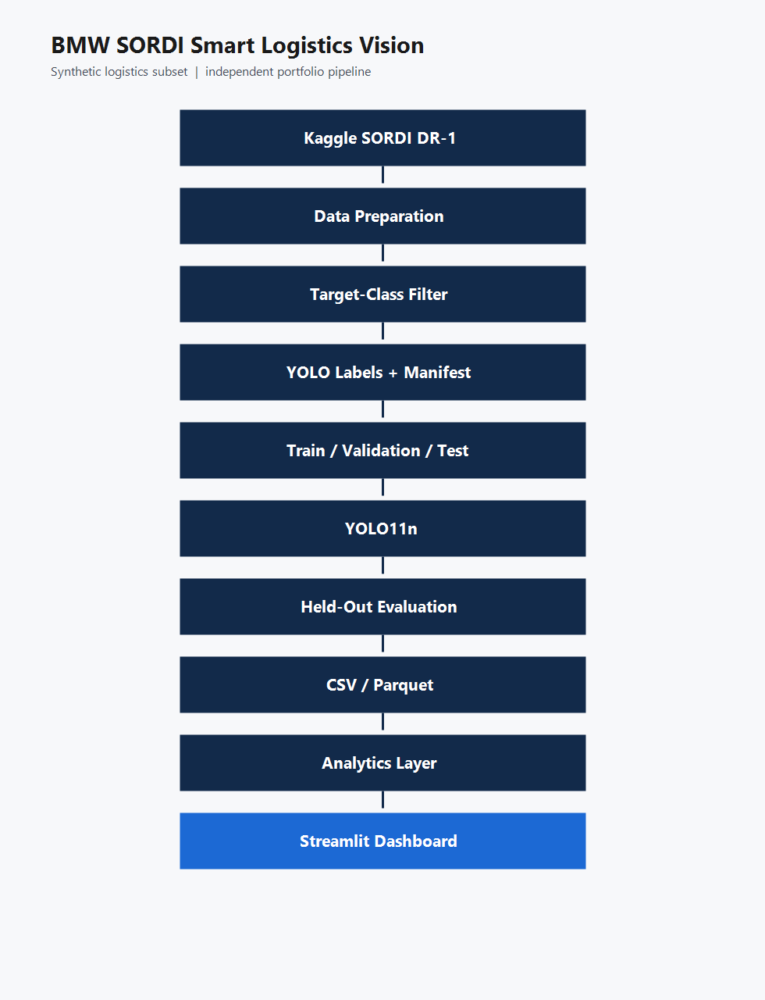

# BMW SORDI Smart Logistics Vision

Portfolio prototype for visual resource monitoring on synthetic industrial logistics scenes. The detector is trained only on a public SORDI subset. This repository is an independent implementation. It is not affiliated with, commissioned by, or endorsed by BMW Group.

## Overview

BMW Group published SORDI so that manufacturing and logistics computer-vision work can start from a large synthetic dataset instead of a private plant archive. This project takes a small logistics slice of the public Kaggle release and carries it through a full technical loop: parse the labels, train a detector, measure it on a held-out split, and turn the predictions into a table and a dashboard.

The question it answers is narrow. On synthetic frames, can a compact detector find pallets, stillages, forklifts, and dollies, and can those predictions be evaluated and exported as operational counts? It does not answer whether that detector would hold up in a real BMW plant.

## Problem

A raw detection score is not yet useful to a logistics analyst. The useful artifact is a checked table: which resource was seen, how confident the box is, and whether the box agrees with the label. This prototype builds that path for four material-handling classes in synthetic scenes.

## Target classes

The model classes are exactly the SORDI names:

- pallet
- stillage (pallet cage)
- forklift
- dolly

Code, configs, labels, exports, and metrics use `stillage`. The words "pallet cage" appear only as a plain-language gloss.

## Architecture



Kaggle DR-1 JSON labels are parsed directly, filtered to the four classes, converted to YOLO labels, and split by image. YOLO11n is fine-tuned, selected on validation, then scored once on the untouched test split. Detections are exported to CSV and Parquet and read by one shared analytics module, which feeds both the notebook and the Streamlit app.

## Dataset

- Source: Kaggle `sordi-ai/industrial-scene-01-dataset`
- Scene split used: DR-1 only. DR-2 is not used.
- Cache location: `C:\Users\tanam\sordi-cache` (outside this OneDrive folder)
- An image is kept only when it contains at least one target box
- Cap: 1,200 images
- Seed: 42
- Split: 70% train / 15% validation / 15% test, with no shared image ids
- The test split is not used for training or for choosing the checkpoint

The prepared subset in `outputs/metrics/dataset_summary.json` has 1,200 images: 840 train, 180 validation, and 180 test. Object counts are pallet 5,105, stillage 9,998, forklift 689, and dolly 3,868. All four classes appear in every split.

## Annotation conversion

Each Kaggle frame has a JSON annotation. This project reads `ObjectClassName`, `Left`, `Top`, `Right`, and `Bottom`, clips the box to the image, and writes a normalized YOLO line: `class_id x_center y_center width height`.

BMW InnovationLab’s older [SORDI Data Pipeline Reader](https://github.com/BMW-InnovationLab/SORDI-Data-Pipeline-Reader) targets the previous ZIP → SQLite → COCO workflow. The current Kaggle release is already per-frame JSON, so this project uses a direct JSON → YOLO converter instead of that reader.

## Model

Ultralytics YOLO11 Nano (`yolo11n.pt`) only. Image size is 640. The laptop GPU is an RTX 3050 with 4 GB, so the batch starts at 8 and drops to 4 if CUDA runs out of memory. A larger YOLO model is not used.

## Training

V1, seed 42, 1,200 images:

- Baseline: 30 epochs from the pretrained nano checkpoint, cosine schedule off
- Tuning cycle: 15 further epochs from the best baseline checkpoint, cosine learning-rate schedule on
- Checkpoint choice uses validation mAP50-95 only
- Both validation results are kept, including the weaker run

## V1 MVP

The original experiment used 1,200 images. Its metrics below are unchanged. Copies of the run metadata, validation metrics, held-out metrics, detection tables, figures, and checkpoint path are in `outputs/v1/`.

<!-- RESULTS:START -->
Scores below are rounded to four decimal places from the JSON files. The full values are in `outputs/metrics/model_selection.json`, `outputs/metrics/test_metrics.json`, and `outputs/metrics/matcher_summary.json`.

Checkpoint choice used validation mAP@0.50:0.95 only. The tuned run was selected: 0.5647 versus 0.5599 for the baseline. The test split was not used for that choice. Batch size stayed at 8 on the RTX 3050. Ultralytics resolved `optimizer=auto` to AdamW with learning rate 0.00125; `run_meta_*.json` still records the requested setting `auto` and `lr0` 0.01.

| Run | Split | Precision | Recall | mAP@0.50 | mAP@0.50:0.95 |
| --- | --- | ---: | ---: | ---: | ---: |
| Baseline | validation | 0.8781 | 0.6363 | 0.7428 | 0.5599 |
| Tuned | validation | 0.8733 | 0.6458 | 0.7499 | 0.5647 |
| Tuned (chosen) | test, both repeats | 0.8208 | 0.6610 | 0.7473 | 0.5623 |

The two held-out Ultralytics validations wrote identical precision, recall, mAP@0.50, and mAP@0.50:0.95 (`identical_repeat` is true).

The dashboard uses a different score. At confidence 0.25, a one-to-one same-class match with IoU at least 0.50 on the test split gives precision 0.7380 and recall 0.7172, from 2,014 true positives, 715 false positives, and 794 false negatives (2,729 exported test predictions). That matcher precision and recall are not mAP.
<!-- RESULTS:END -->

## Per-class results

<!-- PER_CLASS:START -->
Held-out Ultralytics metrics for the chosen tuned checkpoint, identical on both test repeats:

| Class | Precision | Recall | AP@0.50 | AP@0.50:0.95 |
| --- | ---: | ---: | ---: | ---: |
| pallet | 0.8326 | 0.6111 | 0.6918 | 0.4621 |
| stillage | 0.8719 | 0.7135 | 0.8125 | 0.6547 |
| forklift | 0.8040 | 0.7595 | 0.8181 | 0.6752 |
| dolly | 0.7748 | 0.5601 | 0.6669 | 0.4573 |

Matcher counts on the same test predictions (confidence 0.25, IoU 0.50). These are not the AP numbers above.

| Class | TP | FP | FN | Precision | Recall |
| --- | ---: | ---: | ---: | ---: | ---: |
| pallet | 478 | 223 | 235 | 0.6819 | 0.6704 |
| stillage | 1,110 | 288 | 338 | 0.7940 | 0.7666 |
| forklift | 83 | 29 | 25 | 0.7411 | 0.7685 |
| dolly | 343 | 175 | 196 | 0.6622 | 0.6364 |

Stillage has the highest AP@0.50. Dolly has the lowest AP@0.50:0.95 and the lowest matcher recall. Forklift is the rarest class (108 test objects) and still has the highest AP@0.50:0.95 of the four.
<!-- PER_CLASS:END -->

## Error analysis

<!-- ERRORS:START -->
Twelve annotated test images are in `outputs/figures/errors/`. Green is a matched ground-truth box, blue is a true-positive prediction, red is a false positive, and orange is a missed ground-truth box.

On `error_01_false_positive_1045.jpg`, a dark overhead frame has a large orange stillage box that the model missed, two red stillage boxes sitting on a row of purple crates, and a small blue pallet match along the bottom edge. On `error_11_confused_class_2059.jpg`, a blue pallet box overlaps the wooden base under a stack of purple crates that is also marked as a stillage, and a red forklift box sits on the lower-left edge where no forklift body is visible. Those two frames are examples of a missed large stillage, an extra stillage box on crates, a pallet prediction sharing a stillage's footprint, and a forklift false positive at the frame edge.
<!-- ERRORS:END -->

Measured V1 failure counts are in `docs/v1_failure_analysis.md`. On the V1 test export, stillage has the most false positives (288) and the most false negatives (338). Boxes at or below the 25th percentile of relative area have recall 0.3489, against 0.8371 for larger boxes. Images at or above the median object count have recall 0.6970, against 0.7656 for the other images. Forklift is 3.4% of V1 training boxes.

## V2 scale experiment

V2 keeps DR-1 and the same four class names. It does not use DR-2 and it does not use a larger YOLO. Of 9,325 paired DR-1 frames, 9,197 contain at least one target class. The subset is 4,000 of those frames, seed 43, with multilabel sampling so the scarce class is not dropped. No image was duplicated to reach 4,000.

Before sampling, box shares were pallet 25.5%, stillage 51.3%, forklift 3.5%, and dolly 19.7%. After sampling they were pallet 26.2%, stillage 50.9%, forklift 3.5%, and dolly 19.3%. Forklift remains scarce in box count (2,297 of 64,962 boxes) but appears in 2,195 of the 4,000 images. The split is 2,800 train / 600 validation / 600 test, with no shared image ids, and all four classes in every split. The test ids are frozen in `outputs/v2/splits/frozen_test_ids.json`.

This is not the V1 test set. Of the 180 V1 test images, 62 fall in the V2 training split, 8 in V2 validation, and 15 in the V2 test split. V2 model selection does not score the V1 test set. The V1 versus V2 table compares two different held-out splits.

Three validation experiments, each started from pretrained `yolo11n.pt`:

- A: 40 epochs, standard Ultralytics augmentation, cosine schedule off
- B: 60 epochs, cosine schedule on, patience 12
- C: same schedule as B, with augmentation fixed from the V1 failure measurements before training: scale 0.45, mosaic 0.3, horizontal flip 0.5, no rotation, vertical flip, mixup, copy-paste, or random erasing

### Experiment comparison

<!-- V2_COMPARE:START -->
Scores are rounded to four decimal places. Exact values are in `outputs/v2/metrics/experiment_comparison.csv`. All three rows are validation only. The V2 test split was not used.

| Experiment | Epochs | Precision | Recall | F1 | mAP@0.50 | mAP@0.50:0.95 |
| --- | ---: | ---: | ---: | ---: | ---: | ---: |
| A | 40 | 0.8989 | 0.7117 | 0.7944 | 0.8032 | 0.6321 |
| B | 60 | 0.9019 | 0.7289 | 0.8062 | 0.8127 | 0.6448 |
| C | 60 | 0.8867 | 0.7287 | 0.8000 | 0.8095 | 0.6386 |

B has the highest validation mAP@0.50:0.95 (0.6448). A, the 40-epoch data-scale run, is 0.0127 below B. C, the augmentation run aimed at small boxes and crowded frames, is 0.0062 below B. C does raise validation recall for pallet and stillage relative to B, and it does not raise mAP@0.50:0.95. Dolly has the lowest validation recall in every run (0.6227, 0.6501, 0.6490).

The operating threshold was chosen on B's validation predictions only, after the model choice. Matcher F1 peaks at confidence 0.40 (F1 0.7966, precision 0.8963, recall 0.7169, 823 false positives, 2,810 false negatives). Confidence 0.45 is within 0.001 F1 and was not selected. The threshold was then frozen.
<!-- V2_COMPARE:END -->

### Final V2 held-out results

<!-- V2_TEST:START -->
Chosen checkpoint: experiment B, `yolo11n`, confidence 0.40, IoU 0.50. Both Ultralytics repeats and both prediction repeats matched (`identical_repeat` is true).

| Metric | Value |
| --- | ---: |
| Precision | 0.8863 |
| Recall | 0.7043 |
| F1 | 0.7849 |
| mAP@0.50 | 0.7899 |
| mAP@0.50:0.95 | 0.6213 |

Matcher at the frozen threshold, which is not mAP: precision 0.8967, recall 0.7002, F1 0.7864, from 6,690 true positives, 771 false positives, and 2,864 false negatives (7,461 exported test predictions). Mean confidence of those predictions is 0.7925. The low-confidence rate is 0 because the operating threshold is already 0.40.

| Class | Objects | Precision | Recall | AP@0.50 | AP@0.50:0.95 |
| --- | ---: | ---: | ---: | ---: | ---: |
| pallet | 2,470 | 0.8805 | 0.6445 | 0.7310 | 0.5287 |
| stillage | 4,987 | 0.9209 | 0.7359 | 0.8486 | 0.7003 |
| forklift | 347 | 0.8851 | 0.8184 | 0.8644 | 0.7481 |
| dolly | 1,787 | 0.8586 | 0.6184 | 0.7155 | 0.5081 |

The most defensible headline is mAP@0.50:0.95 of 0.6213 on the untouched V2 test split. It is not an accuracy percentage.
<!-- V2_TEST:END -->

### V1 vs V2

<!-- V1_VS_V2:START -->
V1 and V2 were scored on different held-out splits: 180 images and 2,817 boxes versus 600 images and 9,591 boxes. Ultralytics precision, recall, and mAP do not depend on the operating threshold. Matcher counts do. V1 used confidence 0.25. V2 used 0.40.

| Metric | V1 | V2 | Change |
| --- | ---: | ---: | ---: |
| Precision | 0.8208 | 0.8863 | +0.0655 |
| Recall | 0.6610 | 0.7043 | +0.0433 |
| F1 | 0.7323 | 0.7849 | +0.0526 |
| mAP@0.50 | 0.7473 | 0.7899 | +0.0425 |
| mAP@0.50:0.95 | 0.5623 | 0.6213 | +0.0590 |
| Matcher precision | 0.7380 | 0.8967 | +0.1587 |
| Matcher recall | 0.7172 | 0.7002 | -0.0170 |
| False positives | 715 | 771 | +56 |
| False negatives | 794 | 2,864 | +2,070 |
| False positives per image | 3.972 | 1.285 | -2.687 |
| False negatives per ground-truth box | 0.2819 | 0.2986 | +0.0168 |

mAP@0.50:0.95 is higher by 0.0590 (about 10.5% relative). Ultralytics precision and recall are also higher. Matcher recall is slightly lower, and false negatives per object are slightly higher, which fits the move from confidence 0.25 to 0.40. The raw false-negative count is much larger because the V2 test set contains more boxes. False positives per image are lower.

Within V2, the extra epochs in B account for a validation mAP@0.50:0.95 gain of 0.0127 over A. The conservative augmentation in C did not beat B. On the V2 test set, boxes at or below the V1 small-box cutoff (relative area 0.0081) still have matcher recall 0.3302 (838 / 2,538), against 0.3489 on the V1 test set. Larger boxes recall 0.8297. The mAP gain is not a fix for small objects.

Exact rows are in `outputs/v2/metrics/v1_vs_v2.csv`.
<!-- V1_VS_V2:END -->

## Dashboard

The Streamlit app is a prototype view of the exported tables, not a factory monitoring system. Launch it with the command in the reproduce section. The sidebar has a model-version selector for V1 and V2, plus a V1 → V2 comparison section. The checked view is saved at `docs/dashboard.png`. On the V1 test filter it shows 2,729 detections, 715 false positives, and 794 false negatives. On the V2 test filter at confidence 0.40 it shows 7,461 detections, 771 false positives, and 2,864 false negatives.

## Reproduce

Use the project virtual environment. The default `python` on this machine is 3.14 and is not used.

```powershell
C:\Users\tanam\AppData\Local\Programs\Python\Python311\python.exe -m venv .venv
.\.venv\Scripts\python.exe -m pip install -U pip
.\.venv\Scripts\python.exe -m pip install torch==2.6.0+cu124 torchvision==0.21.0+cu124 --index-url https://download.pytorch.org/whl/cu124
.\.venv\Scripts\python.exe -m pip install -r requirements-training.txt
.\.venv\Scripts\python.exe -c "import torch; print(torch.__version__, torch.cuda.is_available(), torch.cuda.get_device_name(0))"
.\.venv\Scripts\python.exe -m src.data_prepare smoke
.\.venv\Scripts\python.exe -m src.data_prepare prepare --i-verified-smoke
.\.venv\Scripts\python.exe -m src.train all
.\.venv\Scripts\python.exe -m src.evaluate
.\.venv\Scripts\python.exe -m src.archive_v1
.\.venv\Scripts\python.exe -m src.analyze_v1
.\.venv\Scripts\python.exe -m src.prepare_v2
.\.venv\Scripts\python.exe -m src.train_v2 all
.\.venv\Scripts\python.exe -m src.evaluate_v2 all
.\.venv\Scripts\python.exe -m src.infer --source path\to\folder --weights ~/sordi-cache/runs/tuned/weights/best.pt
.\.venv\Scripts\python.exe -m src.infer --source path\to\folder --weights ~/sordi-cache/runs/v2_b/weights/best.pt --conf 0.40
.\.venv\Scripts\python.exe -m streamlit run dashboard\app.py
```

Streamlit Community Cloud uses `requirements.txt` only (dashboard deps). Local training uses `requirements-training.txt`. Main file for Cloud: `dashboard/app.py`.


Before the smoke command, put a Kaggle API token at `C:\Users\tanam\.kaggle\access_token` (a `KGAT_` token) or the legacy file `C:\Users\tanam\.kaggle\kaggle.json`. Both are gitignored.

## Limitations

- SORDI scenes are synthetic.
- A synthetic-to-real domain gap remains. These scores are not plant accuracy.
- The training set is a capped subset, not the full SORDI release.
- Only four classes are in scope.
- The V1 training budget was one baseline and one tuning cycle. V2 added three YOLO11n runs and no larger model.
- Training ran on a 4 GB laptop GPU.
- Nothing here was validated in a BMW production environment.
- The model is not suitable for safety-critical use.

## Acknowledgements

SORDI was published by BMW Group and is distributed by SORDI.ai on Kaggle. BMW InnovationLab maintains related open-source tools, including the older data-pipeline reader that this project does not run. Those organisations are credited as the source of the public data and tools. This project is not a partnership with them.

## Disclaimer

This is an independent portfolio project using publicly available SORDI data. It is not affiliated with, commissioned by, or endorsed by BMW Group. Results are based on synthetic data and do not represent performance in real BMW production environments.
